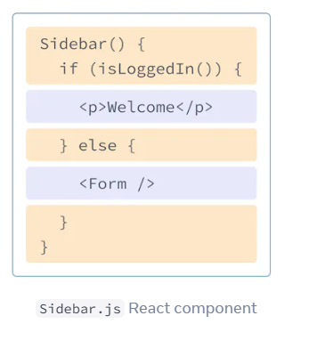
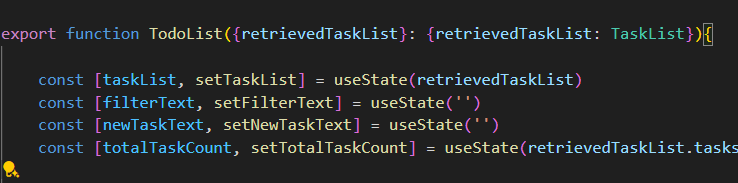
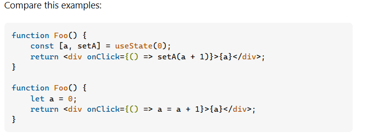

# Week 1
Progress
 
* [React Basics](https://react.dev/learn) (JSX + React) :
    * Quick Start
    * Tic-Tac-Toe
    * Thinking in React

* [TypeScript Basics](https://www.typescriptlang.org/docs/handbook/2/basic-types.html) (TSX + React) :
    * The Basics
    * EveryDay Types (Halfway Through)

* Simple TodoLIst (with the help of Copilot on css)

## Touched Concept
React:
1. Components
2. props
3. Hooks (useState)

TS:
1. Types
2. toggle the strictness in `tsconfig.json`

## Not Yet Touched:
React: 
* Other Hooks (useEffect, useReduce...)
* routing?
* data fetching?
* Rendering?

JS related:
* Async:Promise


# TypeScript vs JSX vs JS
## TypeScript
* A super set of JS
* Add static typing to JS
* Then compiles to plain JS

## JSX
* a syntax extension for JavaScript that lets you write HTML-like markup inside a JavaScript file

# React 

## Components
A fundamental structure in React.
> A component is a piece of the UI (user interface) that has its own logic and appearance. A component can be as small as a button, or as large as an entire page.
```JSX
function MyButton() {
  return (
    <button>
      I'm a button
    </button>
  );
}

export default function MyApp() {
  return (
    <div>
      <h1>Welcome to my app</h1>
      <MyButton />
    </div>
  );
}

```

## props
    Way of passing data from parent components to child.
    using {} to pass argument



## Hooks (useState)
A set of different React Feature.
### State Hooks
State lets a component “remember” information like user input.
```TSX
export function TodoList({retrievedTaskList}: {retrievedTaskList: TaskList}){
    
    ...
    const [newTaskText, setNewTaskText] = useState('')
    ...
```

### Usage
Use `useState` for minimal data but complete representation of UI state.
### useState vs variables
[Ref: StackOverflow](https://stackoverflow.com/questions/58252454/react-hooks-using-usestate-vs-just-variables
)
When using State is changed, it'll triggered the rendering of the page, but not local variable.


## Rendering
* Q: When is the html re-rendered by React (1 instance: on State Change)
* Q: Generally, what decides the latency of a webpage, What contributes a big portion of it? Like rendering?

### Rendering list in react
When a list is re-rendered, React takes each list item’s key and searches the previous list’s items for a matching key. If the current list has a key that didn’t exist before, React creates a component. If the current list is missing a key that existed in the previous list, React destroys the previous component. If two keys match, the corresponding component is moved.


# Framworks

## Vite vs Next.js vs webpack (AI GENed)
* Vite: build tool. best suited for small to medium-sized projects that prioritize fast development and performance. It excels in building modern web applications using ES modules and native browser features.
* WebPack: build tool. It offers extensive configuration options and supports advanced features like code splitting, tree shaking, and caching.
* Next.js :full React framework which used webpack inside. provides server-side rendering (SSR) and static site generation (SSG) capabilities. It uses webpack under the hood for bundling and provides a comprehensive solution for building production-ready React applications.


# CSS

- .board-row:after : specifies the rules for the element after the current element (board-row)

# JS

## ? in JavaScript
```typescript
parameter? : type
```
is equal to
```typescript
parameter: type | undefined
```
## Immutability vs shallow-copy vs deep copy
Immutability: won't change the value of the original object/array.

When doing shallow-copy:
The primitive type value will not be altered.
But object is copied with reference and change the element in the object may lead to changes in the original object/array too.

* Objects will reflect change in the original place from where they were shallowly copied because they are stored as references (to their address in the Heap).

* Primitive data types will NOT reflect change in the original place because they are directly stored in the callstack (in Execution Contexts).

e.g.
```javascript
let animals = ['ant', 'bison', 'camel', [1, 2]];

let t = animals.slice();

t[0] = 'aaa';    // string (primitive datatype)
t[t.length-1][0] = 0;    // array (object)

console.log(t);
console.log(animals);
```
https://stackoverflow.com/questions/47738344/does-javascript-slice-method-return-a-shallow-copy
